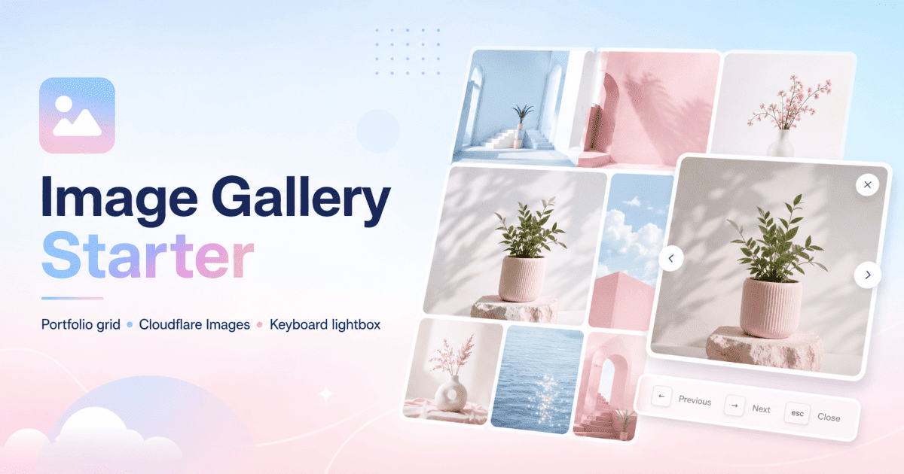
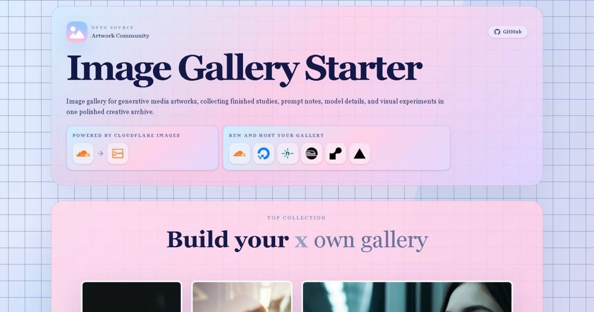

<div align="center">


# Image Gallery Starter

AI image gallery for generative media artworks.

### Prompt archive. Model notes. Hosted media.

<br />

[](https://image-gallery-starter.babysea.live)

<br />

<strong>Project details</strong>

[](#babysea-oss-taxonomy)
[](#status)
[](LICENSE)

<br />

<strong>Checks</strong>

[](https://gitlab.com/babysea/image-gallery-starter/-/commits/main)
[](https://github.com/babysea-community/image-gallery-starter/actions/workflows/sentry-check.yml)
[](https://github.com/babysea-community/image-gallery-starter/actions/workflows/codeql.yml)
[](https://github.com/babysea-community/image-gallery-starter/actions/workflows/package-check.yml)

<br />

<strong>Built with</strong>

[](https://nextjs.org)
[](https://react.dev)
[](https://base-ui.com)
[](https://developers.cloudflare.com/images)

<br />

<strong>One-click deploy</strong>

[](https://cloud.digitalocean.com/apps/new?repo=https://github.com/babysea-community/image-gallery-starter/tree/main)
[](https://app.netlify.com/start/deploy?repository=https://github.com/babysea-community/image-gallery-starter)  
[](https://railway.com/new/template?template=https://github.com/babysea-community/image-gallery-starter)
[](https://render.com/deploy?repo=https://github.com/babysea-community/image-gallery-starter)  
[](https://vercel.com/new/clone?repository-url=https%3A%2F%2Fgithub.com%2Fbabysea-community%2Fimage-gallery-starter&project-name=image-gallery-starter&repository-name=image-gallery-starter&env=NEXT_PUBLIC_SITE_URL,NEXT_PUBLIC_CLOUDFLARE_IMAGES_ACCOUNT_HASH,NEXT_PUBLIC_CLOUDFLARE_IMAGES_DELIVERY_ORIGIN)

<br />



<br />



</div>

<br />

## BabySea OSS taxonomy

BabySea open source projects are organized into three categories:

[](#babysea-oss-taxonomy)
[](#babysea-oss-taxonomy)
[](#babysea-oss-taxonomy)

| Category      | Description                                                                                                                        |
| :------------ | :--------------------------------------------------------------------------------------------------------------------------------- |
| **SDK**       | Typed developer entry points for creating, tracking, and managing BabySea workloads from application code.                         |
| **Primitive** | Reusable infrastructure boundaries extracted from BabySea's execution control plane. Each primitive focuses on one system concern. |
| **Starter**   | Deployable reference applications that combine product UI, runtime configuration, and BabySea publishing patterns.                 |

## Status

BabySea OSS projects are published into three status levels:

[](#status)
[](#status)
[](#status)

| Status         | Description                                                                                                                                                                    |
| :------------- | :----------------------------------------------------------------------------------------------------------------------------------------------------------------------------- |
| **Working**    | Implemented and deployable. All documented capabilities function as described. Suitable for personal creator portfolios and small static showcases.                            |
| **Production** | Working plus a hardened public runtime contract, explicit failure modes, and a documented upgrade path.                                                                        |
| **Alpha**      | Early-stage implementation. Core structure exists but some capabilities may be incomplete, undocumented, or subject to breaking changes. Not recommended for production usage. |

See [`CHANGELOG.md`](CHANGELOG.md) to track releases and public contract changes.

---

## Quickstart

Run locally:

```bash
git clone https://github.com/babysea-community/image-gallery-starter.git
cd image-gallery-starter
pnpm install --frozen-lockfile
cp .env.example .env.local
```

Fill `.env.local` from [`.env.example`](.env.example), then start the app:

```bash
pnpm dev
```

Open <http://localhost:3011>.

## Cloudflare Images

This starter serves hosted Cloudflare Images URLs in this format:

```txt
https://imagedelivery.net/<ACCOUNT_HASH>/<IMAGE_ID>/<VARIANT_OR_OPTIONS>
```

Configure the delivery surface in `.env.local`:

```bash
NEXT_PUBLIC_SITE_URL=http://localhost:3011
NEXT_PUBLIC_CLOUDFLARE_IMAGES_ACCOUNT_HASH=your_account_hash
NEXT_PUBLIC_CLOUDFLARE_IMAGES_DELIVERY_ORIGIN=https://imagedelivery.net
```

For custom domains, use Cloudflare's documented `cdn-cgi/imagedelivery` path:

```bash
NEXT_PUBLIC_CLOUDFLARE_IMAGES_DELIVERY_ORIGIN=https://gallery.example.com/cdn-cgi/imagedelivery
```

## Gallery data

The starter ships with 36 ordered Cloudflare Images records in [`lib/gallery/source-gallery-images.ts`](lib/gallery/source-gallery-images.ts). Feature, grid, hero, and collection views all read from that shared source so replacements stay consistent.

| Surface         | Source                                                                                                                             | Purpose                                                      |
| :-------------- | :--------------------------------------------------------------------------------------------------------------------------------- | :----------------------------------------------------------- |
| Hero            | [`lib/gallery/hero-section-images.ts`](lib/gallery/hero-section-images.ts)                                                         | First five artworks used for the preview surface.            |
| Featured works  | [`lib/gallery/feature-carousel-images.ts`](lib/gallery/feature-carousel-images.ts)                                                 | All 36 artworks in masonry groups.                           |
| Archive grid    | [`lib/gallery/gallery-grid-images.ts`](lib/gallery/gallery-grid-images.ts)                                                         | All 36 artworks in fixed-size scan cards.                    |
| Collections     | [`lib/gallery/stack-section-images.ts`](lib/gallery/stack-section-images.ts)                                                       | Twelve three-image collection cards generated in order.      |
| Shared metadata | [`lib/gallery/gallery-image.ts`](lib/gallery/gallery-image.ts), [`source-gallery-images.ts`](lib/gallery/source-gallery-images.ts) | Image titles, prompts, model labels, variants, and alt text. |

## Runtime

- The app is a public, one-page creator gallery. It has no database, auth, server actions, billing, or private workspace state.
- Every image card uses `ProtectedImage` to discourage drag and context-menu downloads from the browser UI.
- The lightbox shows prompt, model, and size metadata vertically for each artwork.
- Touch interactions let mobile users preview image hover states.
- Cloudflare Images account hash and delivery origin are public `NEXT_PUBLIC_*` values because image URLs render in the browser.
- Static security headers and a small CSP are applied from [`lib/security/csp.ts`](lib/security/csp.ts).
- Sentry is optional. Leave `NEXT_PUBLIC_SENTRY_DSN` blank for a no-op runtime, or set it to enable client/server error reporting with source-map upload when Sentry build secrets are configured.

## Deployment

### DigitalOcean

[`.do/deploy.template.yaml`](.do/deploy.template.yaml) defines the DigitalOcean App Platform service, build command, start command, and environment prompts. Set `NEXT_PUBLIC_SITE_URL` to the App Platform or custom domain and configure the Cloudflare Images variables during app creation.

### Netlify

[`netlify.toml`](netlify.toml) builds with `pnpm run build`, publishes `.next`, and uses the Next.js plugin. The Netlify deploy button prompts for the public Cloudflare Images environment values.

### Railway

Use the Deploy on Railway button above to create a new Railway project from the public repository. Add the variables from [`.env.example`](.env.example), then set `NEXT_PUBLIC_SITE_URL` to the Railway or custom domain.

### Render

[`render.yaml`](render.yaml) builds with `pnpm build` and runs `pnpm start -- -p $PORT`. Add the variables from [`.env.example`](.env.example) in the Render dashboard before the first deploy.

### Vercel

Keep the checked-in [`vercel.json`](vercel.json) framework settings. Set `NEXT_PUBLIC_SITE_URL` to the Vercel or custom domain, and set `NEXT_PUBLIC_CLOUDFLARE_IMAGES_ACCOUNT_HASH` to your Cloudflare Images account hash.

## Customize

| Change             | Files                                                                                                                                              |
| :----------------- | :------------------------------------------------------------------------------------------------------------------------------------------------- |
| Gallery images     | [`lib/gallery/source-gallery-images.ts`](lib/gallery/source-gallery-images.ts)                                                                     |
| Gallery types      | [`lib/gallery/gallery-image.ts`](lib/gallery/gallery-image.ts)                                                                                     |
| Homepage layout    | [`app/page.tsx`](app/page.tsx)                                                                                                                     |
| Metadata and icons | [`app/layout.tsx`](app/layout.tsx), [`public/icon.png`](public/icon.png), [`public/card.png`](public/card.png)                                     |
| Visual system      | [`styles/globals.css`](styles/globals.css)                                                                                                         |
| Image protection   | [`components/protected-image.tsx`](components/protected-image.tsx), [`components/gallery/touch-event.tsx`](components/gallery/touch-event.tsx)     |
| Security headers   | [`lib/security/csp.ts`](lib/security/csp.ts), [`next.config.ts`](next.config.ts)                                                                   |
| Monitoring         | [`instrumentation.ts`](instrumentation.ts), [`instrumentation-client.ts`](instrumentation-client.ts), [`lib/monitoring`](lib/monitoring)           |
| Deploy config      | [`.do/deploy.template.yaml`](.do/deploy.template.yaml), [`netlify.toml`](netlify.toml), [`render.yaml`](render.yaml), [`vercel.json`](vercel.json) |

## Troubleshooting

| Symptom                        | Fix                                                                                                                                                               |
| :----------------------------- | :---------------------------------------------------------------------------------------------------------------------------------------------------------------- |
| Images do not load             | Confirm `NEXT_PUBLIC_CLOUDFLARE_IMAGES_ACCOUNT_HASH` and `NEXT_PUBLIC_CLOUDFLARE_IMAGES_DELIVERY_ORIGIN` are correct.                                             |
| Custom domain images 404       | Use the Cloudflare Images `cdn-cgi/imagedelivery` origin path and confirm the image IDs exist in the same Cloudflare account.                                     |
| Local site metadata is wrong   | Set `NEXT_PUBLIC_SITE_URL=http://localhost:3011` in `.env.local` before running `pnpm dev`.                                                                       |
| Deploy preview shows old media | Redeploy after changing public environment variables; `NEXT_PUBLIC_*` values are baked into the client build.                                                     |
| Sentry is silent               | Confirm `NEXT_PUBLIC_SENTRY_DSN` is set for runtime reporting and `SENTRY_ORG`, `SENTRY_PROJECT`, `SENTRY_AUTH_TOKEN` are set only in CI secrets for source maps. |
| Formatting fails               | Run `pnpm format:fix`, then rerun `pnpm format`.                                                                                                                  |

## Security and compliance

The project publishes its trust signals through public GitHub, GitLab, and other CI provider checks so contributors can inspect the actual CI configuration, jobs, and reports.

## Community

Issues, pull requests, design discussion, and security reports should follow [`CONTRIBUTING.md`](CONTRIBUTING.md), [`CODE_OF_CONDUCT.md`](CODE_OF_CONDUCT.md), and [`SECURITY.md`](SECURITY.md).

## License

[Apache License 2.0](LICENSE).
